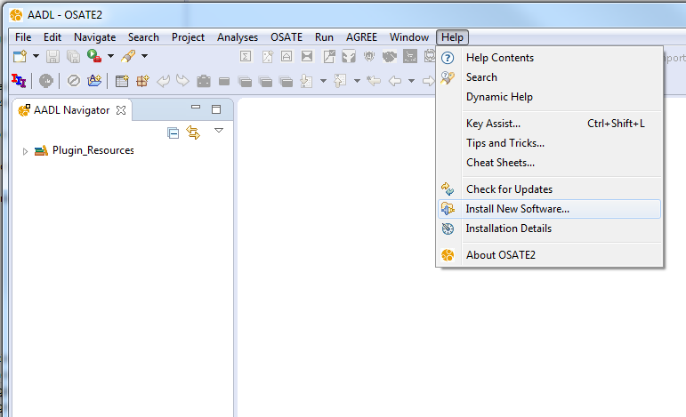
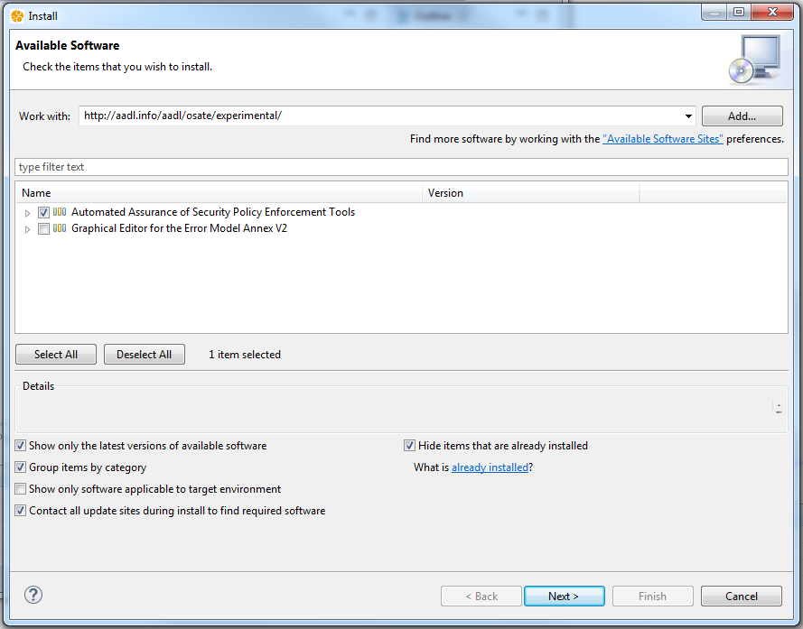

Automated Assurance of Security Policy Enforcement (AASPE)
==========================================================

# About the tools
The AASPE tools are designed for making secure and safe safety-critical systems. The tools are using AADL and the OSATE toolset. It provides the following features:
 - Attack Impact meta-model
 - Attack Impact graphical editor
 - Attack Tree editor meta-model
 - Attack Tree graphical editor
 - Bridge from Attack Impact to Attack Tree
 - Bridge from AADL to Attack Impact

# Installing the tools

## Step by step version

### Step 1: Download ans install OSATE
Go on OSATE [official website](http://www.osate.org) and download it.
Unzip the product on your laptop.

## Step 2: Start OSATE

Once OSATE is installed, double click on the executable to launch it.

## Step 3: Install the security tools

In the Help menu, select Install New Components, as shown below.

Select the experimental website http://aadl.info/aadl/osate/experimental/
Once the list of available components is shown, select the AASPE tools, as below. Accept the license, confirm and restart OSATE.

## TL;DR version
To install the tools, you can use the update site
and select what you want to install in Eclipse.

Use the update site of the [experimental version of osate](http://www.osate.org). The URL of the experimental features is: http://aadl.info/aadl/osate/experimental/

# Examples
Examples to exercise the tools are available in the [edu.cmu.aaspe.examples](https://github.com/cmu-sei/AASPE/tree/master/edu.cmu.aaspe.examples) project.
You can import it in eclipse or view it directly on github.

# Documentation
You can get documentation inside the tool (in the OSATE help) or get it directly by browsing the [related github documentation project](https://github.com/cmu-sei/AASPE/tree/master/edu.cmu.aaspe.help/resources/markdown)
