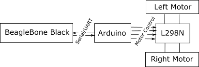
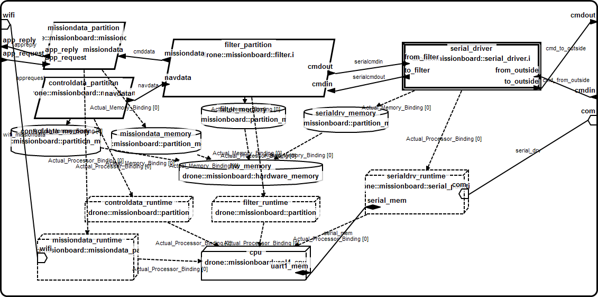

Drone case-study
================

The drone example

# Requirements

## Hardware list

The total hardware cost is about $100. You need the following components.

 * [1 beagleboard black (BBB)](https://beagleboard.org/black) - $55
 * [1 arduino uno](https://www.arduino.cc/en/Main/ArduinoBoardUno) - $25
 * [1 L298N module](http://www.instructables.com/id/Arduino-Modules-L298N-Dual-H-Bridge-Motor-Controll/) to control the motors on the arduino (you can find that [easily on ebay](http://www.ebay.com/itm/Dual-H-Bridge-DC-Stepper-Motor-Drive-Controller-Board-Module-Arduino-L298N-HG-/281551893660?hash=item418dccf49c:g:sm8AAOSwYGFUsJ9I))- $3
 * [1 2WD robot chassis](http://www.ebay.com/itm/2WD-Robot-Car-Chassis-Kit-For-Arduino-Raspberry-Pi-w-Encoder-and-Battery-Box-/321798608491?hash=item4aecb1166b:g:FuoAAOSwoBtW40I0) - $15


In order to connect everything together, you will need to be able to solder and connect wires.


## Software list
 * [OSATE environment](http://www.osate.org) - experimental version
 * [Arduino development environment](http://www.arduino.cc)

# Architecture

## Hardware Architecture



The hardware architecture is pretty simple: the beaglebone black is connected to the arduino through a serial connection and the arduino. The system is using the UART1 from the Beablebone Black and the serial line of the arduino. UART1 of the Beaglebone Black is on the PIN 24 and PIN 26 of the expansion board P9. You have to connect these pins on the Serial line of the Arduino.

The Arduino is connected to the L298N using the digital PIN 2, 3, 4 and 5. The following diagram show how to connect them (blue arrows). You just need to connect these four PINS, the rest is not useful.


The L298N module also needs power to activate the motors. You have an input for power up to 12v. We uses the power from the batteries included with the chassis.

The L298N module also needs an 5V input to work. You can get 5V from the arduino. Just connect the 5V output from the arduino (5V on the power PIN), see schema below.


Finally, you need to connect the motors to the L298N board. Pretty easy and there is no change to make a mistake. The only mistake you can do is to invert the wires. If this happens, it will just invert the direction of how your motor rotates.

## Software Architecture

### Arduino

The software architecture of the arduino is very simple and is composed of a single task, as [shown in the code](https://github.com/cmu-sei/AASPE/blob/master/edu.cmu.aaspe.examples/drone-case-study/arduino/arduino/arduino.ino). It is a simple loop that receives command from the beaglebone (through the serial) and activates the different motors.

### BeagleBone Black

The software architecture of the BBB is more complicated. The beaglebone black uses different partitions executed on top of [seL4](http://sel4.systems/), a formally verified operating system. The reason why we are using such an OS is because it provides isolation guarantees and ensures that one partition cannot interfere with another other than with the explicitly configured communication channels.

The overall software architecture of the BeagleBone Black is shown below, as a graphical AADL model. The root system is available in the public AADL model repository and the associated [eclipse project](https://github.com/cmu-sei/AASPE/tree/master/edu.cmu.aaspe.examples). The root system is in the file drone-case-study/missionboard.aadl and is named ```board.debug_beagleboard```.



The system is composed of 4 partitions:
 * ** *missiondata* ** receives incoming requests to get sensor values from the drone. This partition is not security-critical: the data it handles are not too critical. In addition, a crash of this partition does not impact the correct movement of the vehicle.
 * ** *controldata* ** controls the drone by sending command to the motors (go left, right, straight, etc.). This partition is critical because it is vital to the correct operation of the drone.
 * ** *filter* ** sends/receives data to/from the arduino board (through the *serial_driver* partition). It correctly encode/decode the messages from the *serial_driver*. This is this partition that contains data that is critical (from the *controldata* partition) and non-critical (from the *missiondata* partition). It is then crucial to implement this component correctly and ensures correct separation of the different data.
 * ** *serial_driver* ** receives/sends characters through the serial driver. It accesses a particular memory region in order to control the UART1 of the Beaglebone Black. This component is not responsible to separate the different data classified at various security levels.

## Serial Protocol
In order to control the motors, the beaglebone sends data to the arduino. Message are composed like this:

```
:X:123:
```

where:
 * ```X``` is the command. It is a single letter. It can take the following values: U (up), D (down), L (left), R (right).
 * ```123``` is the value applied tot he motor. The value is between 0 and 999. Any value higher is rejected by the system.

For example, the following command ```:U:100:``` will activate both motors to move forward. If we issue the command ```:L:200:``` it sets the value of the left motor to 200, regardless of the value of the right motor.


# Reproducing the case-study

## Importing the model

## Generating the code

## Compiling the code for seL4

## Running the code on the seL4

## Importing the arduino code

## Running the code on the arduino
