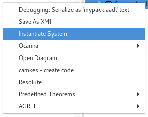
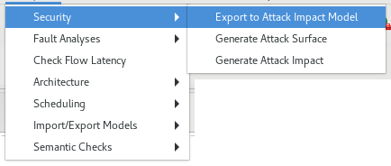

# Attack Impact Generation

Our tool include a generator that creates an Attack Impact model from an AADL model. The tool relies on an engine that analyzes the model, detect vulnerabilities and their impact inside an AADL model. It extracts these information and generate an Attack Impact.

The engine is using pre-defined rules to detect vulnerabilities. For each component, the engine applies the rules in order to
 1. Retrieve the list of all vulnerabilities related to the component
 2. See the impact of a vulnerability within the architecture

Our tool contains a set of pre-defined rules. This set is presented in this current documentation. Users can also extend the rules themselves. The presentation documentation also explain how to do this.

## Using the Generator

For generating the Attack Impact, you need first to instantiate your AADL model.
To do so, in the outline view, select the root system component, right-click on it and select the menuitem *Instantiate System*.

Once the system is instantiated, it creates an *instances* directory. Within that directory, there are the files created by the instantiation process. The following pictures show one file in that directory.

To generate the Attack Impact, select the instance file generated before. Then, select the *Analysis* menu and go through the following items: *Security* and *Export to Attack Impact Model*, as shown below.

Once the process is completed, it generates a file with the extension *.attackimpact* in the *instances* model. This file is the corresponding attack impact of the selected AADL model instance.

