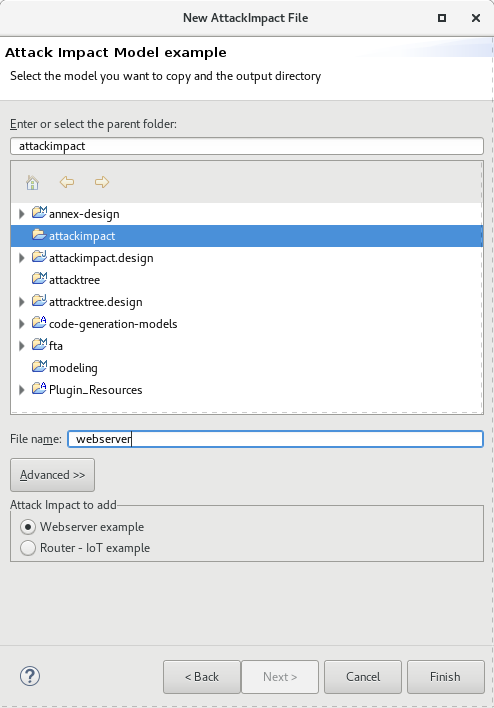
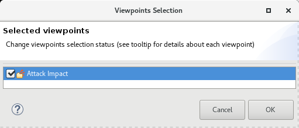
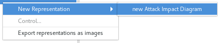
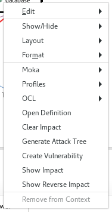

# Attack Impact Editor

## What it is?
An Attack-Impact is a model that represents all the systems of an architecture with their interaction points and potential propagations of vulnerabilities. It is a graph that shows the components with boxes, vulnerabilities using around rounds and finally, connect them together using directed arrows.

The objective is to show how a vulnerability can propagate through the system architecture. Such a notation ultimately support design decisions by highlighting how security issues impact the system and help designer to detect and fix architecture weaknesses.

## Implementation Concerns
Our Attack Impact editor relies on an EMF meta-model of an attack tree as well as a Sirius representation for it. The Sirius representation generates the graphical representation (graph) from the meta-model.

## Examples of Attack Impact
To open an example of an Attack Tree, do the following

 * Create a new project by using *New* -> *Project*. Select the name of the project and click on *Finish*

 * Right click on the new project and select *New* -> *Other* and select

 

 * Select the *Attack Impact Wizard*

 

 * Choose the example you want (webserver or router), indicate a file name and click on Finish.

 

## Visualizing the Attack Impact

 * Make sure you have your Attack Impact file in your project. The file has the extension *attackimpact*. See the previous section to create an Attack Impact file example.
 * Switch to the Modeling Perspective. Check that the modeling perspective is activated as in the following picture. The icon is on the top right in the eclipse main window.

 

 * Make sure the project has the Modeling Nature. Right Click on your project and check the item *Configure* -> *Convert to Modeling Project*.

 

 * Select the Attack Tree Viewpoint. Right click on te project and select the following menu

 

 * Select the Attack Impact Viewpoint

 

 * Finally, open the Attack Impact Representation. Select the model element (the Attack Impact Model EObject) and right click on it. Select *New Representation* and then *new AttackImpactDiagram*.

  

 * You should then get the following diagram.

 

## Analyzing the Attack Impact

The Attack Impact editor includes build-in analysis capabilities. You can visualize the menu that offers the analysis options by doing a right click on a nod ein the Attack Impact diagram. This menu is shown below.

There are the following analysis available:

 * **Generate Attack Tree**: generate the attack tree from the selected component. The generated attack tree will have a root that is the selected node of the attack tree.
 * **Show Impact**: shows the impact of this component or vulnerability. It will then color all component being impact by the selected component or vulnerabilities.
 * **Show Reverse Impact**: do the reserve analysis than the  **show impact**: it traverses the model backwards and color all components that contribute to corrupt the selected components.
 * **Clear Impact**: revert any color change in the model. If the user used the impact or reverse impact analysis, it will then remove the color on every box.

## Editing an Attack Impact

This section has to be improved and ehanced.

## Contact and Help
For any help and contact, please send an e-mail to Julien Delange <jdelange@sei.cmu.edu>
