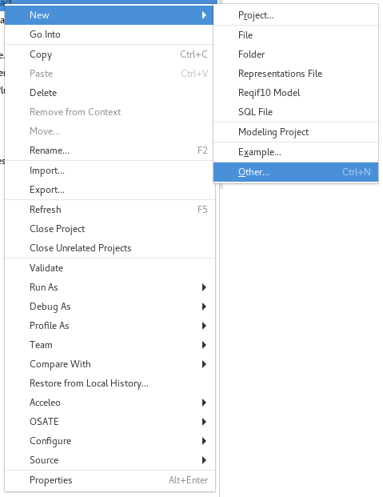
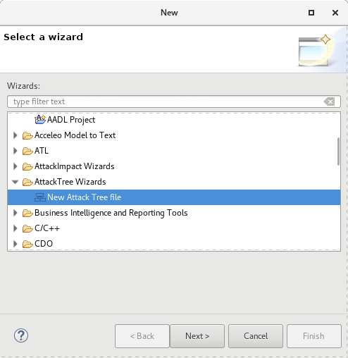
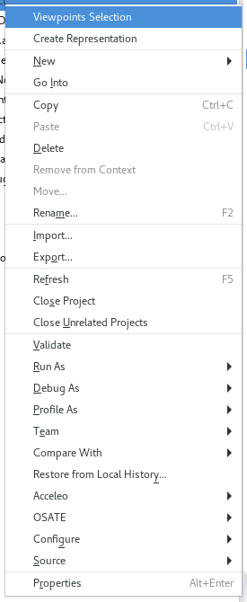
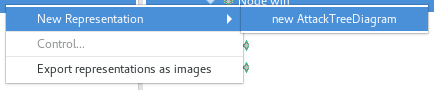

# Attack Tree Editor

## What it is?
An Attack-Tree is a graphical model that show all contributor of a successful compromising of a system. It uses a tree notation with the root being the system being compromised and the leafs being the vulnerabilities or the nodes that propagates the vulnerabilities or attacks.

Such a diagram shows all the contributors that can facilitate a successful attack against a given system. It also helps to understand the path from a vulnerability to the impacted system.

## Implementation Concerns
Our Attack Tree editor relies on an EMF meta-model of an attack tree as well as a Sirius representation for it. The Sirius representation generates the graphical representation of the tree from the meta-model.

## Examples of Attack Tree
To open an example of an Attack Tree, do the following

 * Create a new project by using *New* -> *Project*. Select the name of the project and click on *Finish*

 * Right click on the new project and select *New* -> *Other* and select

 

 * Select the *Attack Tree Wizard*

 

 * Choose the example you want, indicate a file name and click on Finish.

 

## Visualizing the Attack Tree

 * Make sure you have your Attack Tree file in your project. The file has the extension *attacktree*. See the previous section to create an attacktree example.
 * Switch to the Modeling Perspective. Check that the modeling perspective is activated as in the following picture. The icon is on the top right in the eclipse main window.

 

 * Make sure the project has the Modeling Nature. Right Click on your project and check the item *Configure* -> *Convert to Modeling Project*.

 

 * Select the Attack Tree Viewpoint. Right click on te project and select the following menu

 

 * Select the Attack Tree Viewpoint

 

 * Finally, open the Attack Tree Representation. Select the model element (the Attack Tree Model EObject) and right click on it. Select *New Representation* and then *new AttackTreeDiagram*.

  

 * You should then get the following diagram.

  

## Editing an Attack Tree

This section has to be completed.

## Contact and Help
For any help and contact, please send an e-mail to Julien Delange <jdelange@sei.cmu.edu>
